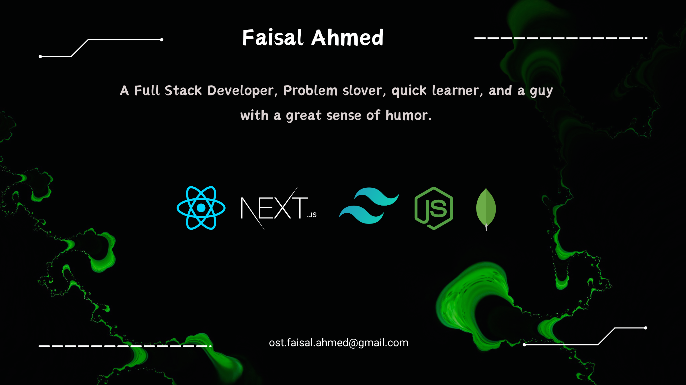

 

<h1>Hi 👋, I'm Faisal Ahmed</h1>
<h3>A passionate Full Stack Developer</h3>

I'm a passionate Full Stack Developer and a Computer Science student in my final semester. Dedicated to bringing life to ideas, I have honed my skills in JavaScript, TypeScript, React, Next.js, Express.js, MongoDB, Redux Toolkit, and RTK Query. I excel at building responsive web applications, designing RESTful APIs, and managing complex state logic, with experience in tools like Git, Postman, VsCode.

A quick learner, I spend days finding optimal solutions to challenging problems. Currently, I'm exploring advanced features of Next.js and performance optimization in React applications. I enjoy collaborating with other developers and contributing to open-source projects.

 
<h2>⚒️ Technologies That I Know</h2>
 

    
     
    

 

## 💹Current Stats

    

    

    
    
    

## 👓 Current overview

**🥅 Goals of 2024 🥅** - <b>Docker, GraphQL, AWS</b>
 
**🤝 I’m looking** - To collaborate on open-source project
